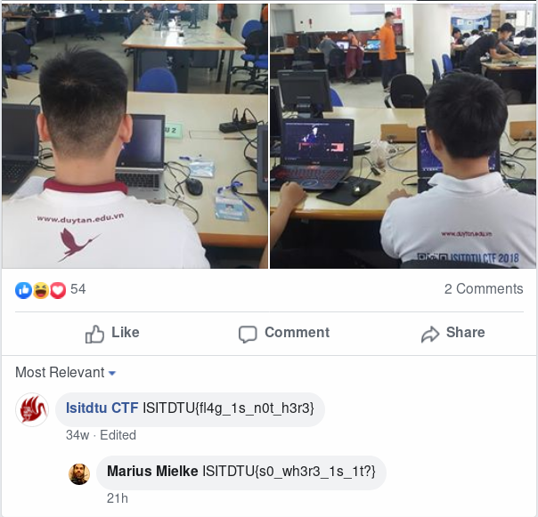
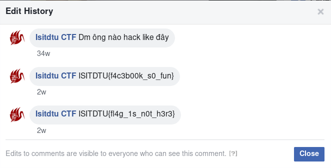

# F4c3b00k

**category**: Misc

**points**: 100

**solver**: gorei

---

## Task

I put a flag at our fanpage, but I forgot where it is, can you help me find a flag?

## Solution

Open Facebook web page of this CTF - [https://www.facebook.com/isitdtu](https://www.facebook.com/isitdtu).

Scroll few posts and read comments until some interesting is found.

The comment is in the correct flag format. However, it says (in leetspeak) "flag is not here". We might get a bit suspicious after seeing that the comment was edited. And really, showing the edit history leads to the right flag.

