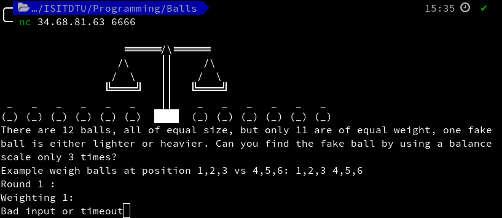
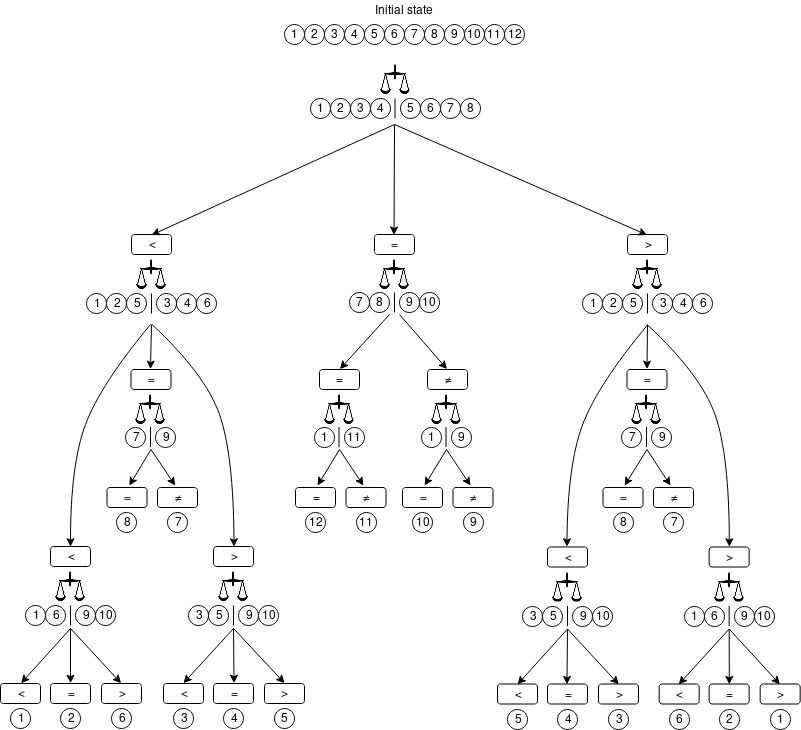

# Balls

**category**: Programming

**points**: 100

**solver**: gorei

---

## Task

There are 12 balls, all of the equal size, but only 11 are of equal weight, one fake ball is either lighter or heavier. Can you find the fake ball by using a balance scale only 3 times?

`nc 34.68.81.63 6666`

---

After connecting to the server:

The rules are very similar to those in "Do you like math?" challenge - a short time for answering and 50 repetitions before the successful end.

## Solution

 - [Code](https://gitlab.stdin.cz/ts/code-from-ctf-challenges/blob/master/ISITDTU/balls.py)
 - [Output](https://gitlab.stdin.cz/ts/code-from-ctf-challenges/blob/master/ISITDTU/balls_output.txt)

This is the strategy I used (one of many possible):

After the first weighting, we can say whether the fake ball is one of those used on the scale (1 - 8, if it does not stay in balance), or the rest (9 - 12, otherwise). But we also gained additional knowledge about a "control group", i.e. balls that are for sure the right ones. That leads to quickly finishing the *equal to* subtree.

The other two subtrees (*lower than* and *greater than*) are a bit more tricky. Just an example of what it means to get twice *lower than*:
 - balls 1 and 2 can be lighter or normal
 - balls 3 - 5 are normal
 - ball 6 can be normal or heavier
 - balls 7 - 12 are normal

Applying the same logic to the rest leads to definite identification of all possible outcomes.
