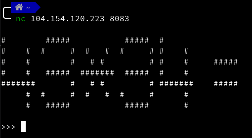

# Do you like math?

**category**: Programming

**points**: 100

**solver**: gorei

---

## Task

`nc 104.154.120.223 8083`

---

After connecting to the server, we get an easy math problem given in ASCII art. E.g.:

The limitation here is that we are quite short on time to provide the right answer. And also, before getting to the flag, we need to answer many of these tasks correctly. So probably the best solution is to write a program that handles everything itself.

## Solution

 - [Code](https://gitlab.stdin.cz/ts/code-from-ctf-challenges/blob/master/ISITDTU/do-you-like-math.py)
 - [Output](https://gitlab.stdin.cz/ts/code-from-ctf-challenges/blob/master/ISITDTU/do-you-like-math_output.txt)
